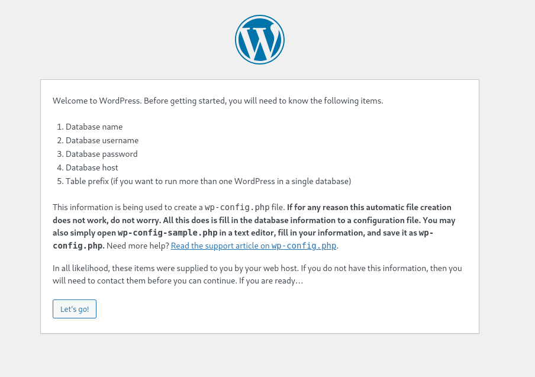

# Wordpress Setup on EC2

## Objectives

- [Installation Steps Overview](#installation-steps-overview)
- [Automate Installation on Instance Launch](#automate-installation-on-instance-launch)

## Introduction
In a previous [lab](SetupOnWordpress_com.md), we have investigated using Wordpress in a Software-as-a-Service running on wordpress.com.  In this lab, we will install Wordpress on a RHEL server.  

## Installation Steps Overview

The high level installation steps of Wordpress is as follow.  These steps are what you would have done if you manually install Wordpress.  We will be performing an automated install in the [following](#automate-installation-on-instance-launch) section, so the commands in this section are for reference only. 

1. Install PHP packages: php, php-cli, php-mysqlnd

```bash
sudo dnf install php php-cli php-mysqlnd -y
```

2. Install httpd

```bash
sudo dnf install httpd -y
```
3. Start and enable httpd

```bash
sudo systemctl start httpd
sudo systemctl enable httpd
```

4. Prepare a database such as MariaDB.  We will create and use a database on AWS RDS. 

5.  Download the latest wordpress tarball

```bash
curl https://wordpress.org/latest.tar.gz --output wordpress.tar.gz
```

6. Extract the wordpress tarball

```bash
tar xf wordpress.tar.gz
```

7. Copy over the extracted Wordpress directory over to the *DocumentRoot* of httpd

```bash
sudo cp -r wordpress /var/www/html
```

8. Change the ownership of the files in the Wordpress directory to the User and Group that httpd is running as, in most cases it will be apache:apache

```bash
sudo chown -R apache:apache /var/www/html/wordpress
```

9. If the Linux server is running SELinux, change the context of the Wordpress directory accordingly to `httpd_sys_rw_content_t`

```bash
sudo chcon -t httpd_sys_rw_content_t /var/www/html/wordpress -R
```

10. Make the changes to SELinux so that httpd can make outward connection (as it needs to connect to the external db server)
```bash
setsebool -P httpd_can_network_connect 1
```

11. Continue the configuration via the webpage at: `http://IPADDR/wordpress`


## Automate Installation on Instance Launch

Follow these procedures for automated install of Wordpress upon instance first launch.  

1. Ensure that a database has been setup on RDS.  Ensure that a security group `Webserver` has been setup for the use of the web servers, and that this security group is allowed to access the database server.  

2. Launch an RHEL EC2 instance from the AWS Console, settings:

- Name: `MyWordpress`
- AMI: `Redhat`
- Key pair: Ensure that you have access to the chose key pair
- Security Group: Select existing security group `Webserver`
- User data: Enter the following

```bash
#!/bin/bash

dnf install php php-cli php-mysqlnd -y
dnf install httpd -y
systemctl start httpd
systemctl enable httpd

mkdir /usr/local/src
cd /usr/local/src
curl https://wordpress.org/latest.tar.gz --output wordpress.tar.gz
tar xf wordpress.tar.gz
cp -r wordpress /var/www/html
chown -R apache:apache /var/www/html/wordpress
chcon -t httpd_sys_rw_content_t /var/www/html/wordpress -R
setsebool -P httpd_can_network_connect 1
```

Wait for the instance launch state to turn to `Running`, and the Status Check to reach `2/2 checks passed`.  You can get a coffee in the meantime.  

When the server boots up you should see the initial screen similar to the one 

You can then continue to configure Wordpress via the web with the RDS details from step 1 above.  


## Lab

1. Follow the steps given in [this](#automate-installation-on-instance-launch) section to launch an AWS EC2 instance that automatically installs Wordpress upon instance launch.  

## Conclusion

In this lab, we have investigated the steps to manually install Wordpress.  We are able to automate this by using the *User Data* section while launching the instance, eliminating any need for manual interventions.  


## References

1. [How to install WordPress on RHEL 8 / CentOS 8 Linux](https://linuxconfig.org/install-wordpress-on-redhat-8)

2. [Run commands on your Linux instance at launch](https://docs.aws.amazon.com/AWSEC2/latest/UserGuide/user-data.html)
