# Introduction

[WordPress](https://wordpress.com/) is a widely acclaimed website platform renowned for its versatility and user-friendliness. It powers a vast array of websites, from personal blogs to major online publications and e-commerce sites. Notable examples include [BBC America](https://www.bbcamerica.com/) and [TechCrunch](https://techcrunch.com/) all of which rely on WordPress to deliver their content and engage with their audiences effectively. These diverse and high-traffic websites demonstrate the platform's adaptability and scalability, making it a preferred choice for individuals and organizations looking to establish a robust online presence.

# Objectives

In this activity, you will sign up for a wordpress account and build a website using the hosted version of Wordpress. This activity will take roughly **30 minutes** to complete.

## Procedures

1. Navigate to the [Wordpress](https://wordpress.com/) website.  Click on the "Get Started" icon at the top right corner of the webpage: 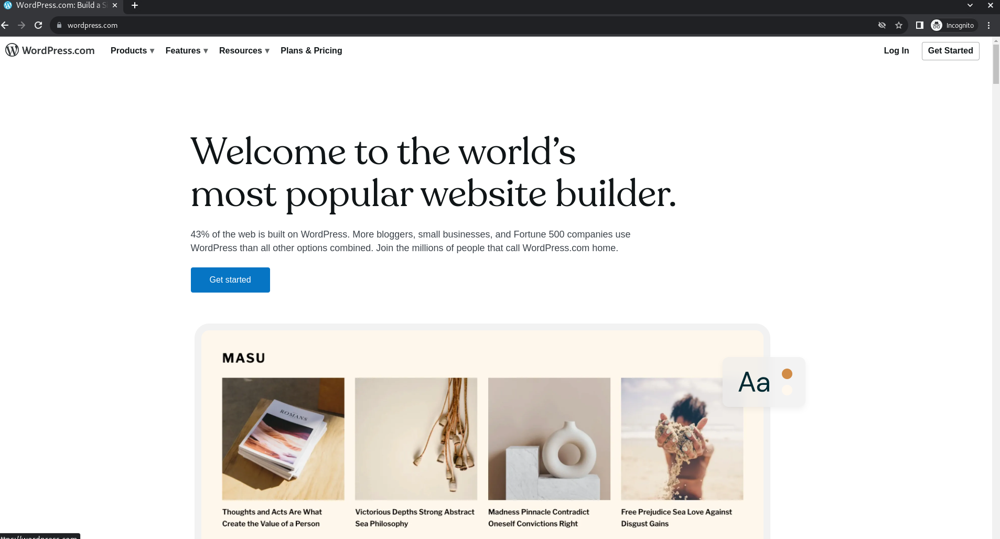

2. Create a Wordpress account.  You can either create an account based on an email address, or use Google / Apple for Single Sign-On (SSO): 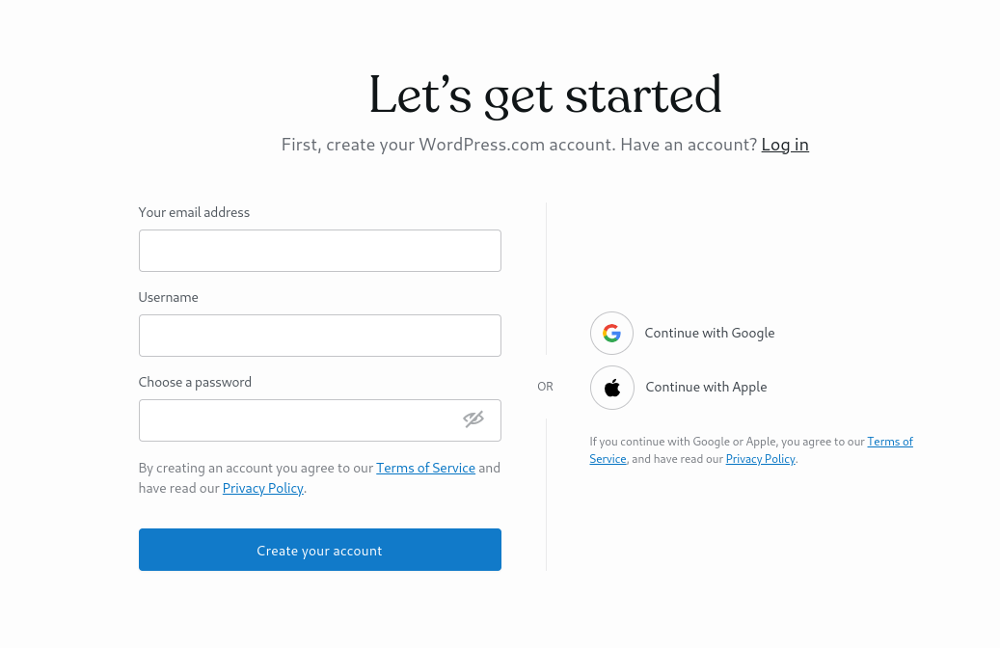

3. You may create a new account or use Google / Apple SSO to sign into Wordpress.  You should see a page similar to this: 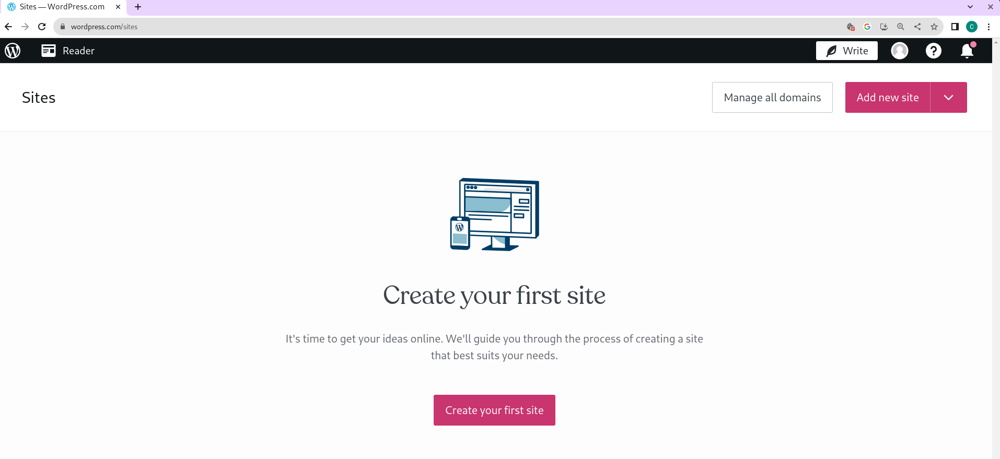
If you do not see the page above, try going directly by following this [URL](https://wordpress.com/sites).  

4. Click on the button that says "Create your first site" after that select "Choose my domain later" on the right pane: 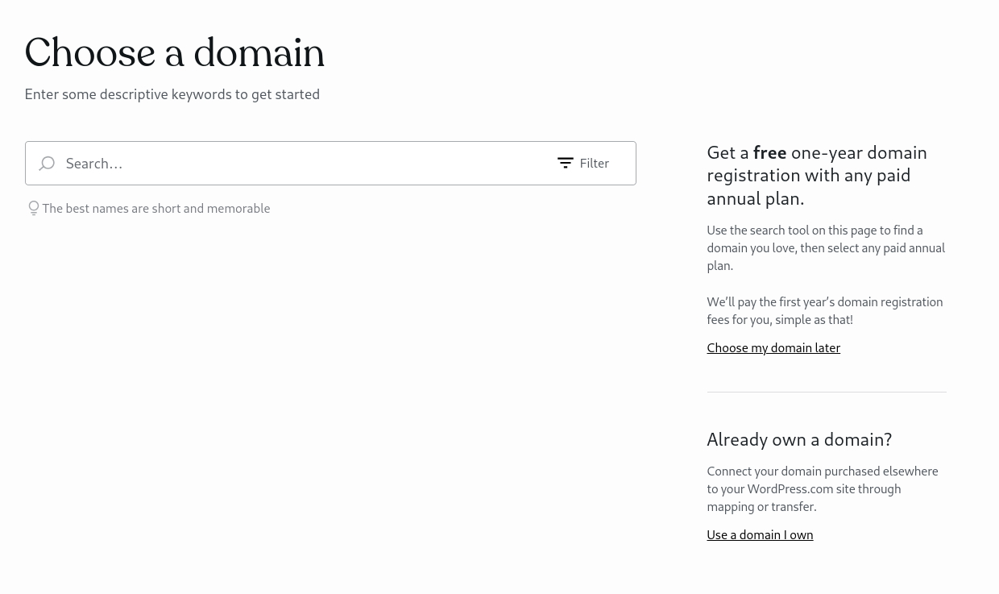 

5. In the next screen, choose your plan. For the purpose of this exercise, you can choose the Free plan: 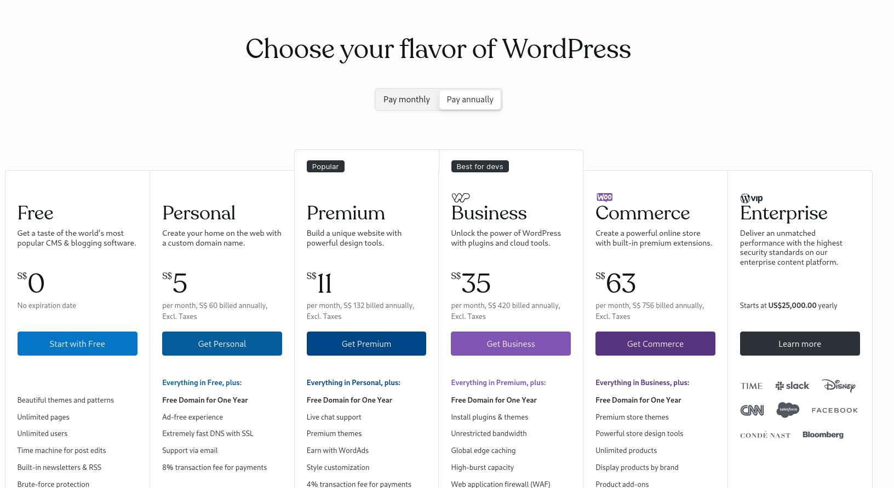

6. In the following screen, set your goals.  For the purpose of this exercise, you can choose "Write & Publish": 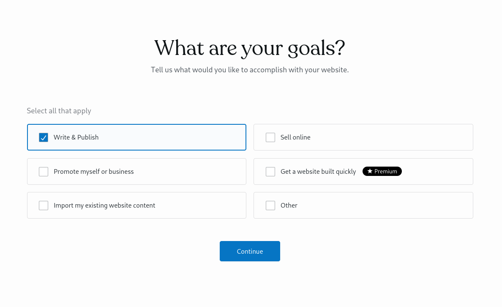

7. We are almost there. Give your site a name: 

8. You are now ready to "Draft your first post"!: 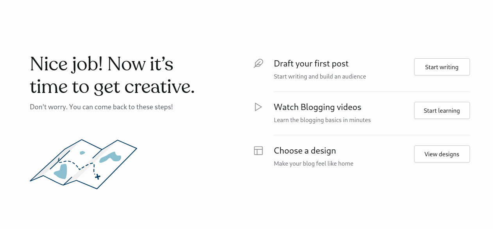

9. Go ahead and edit your website from the browser: 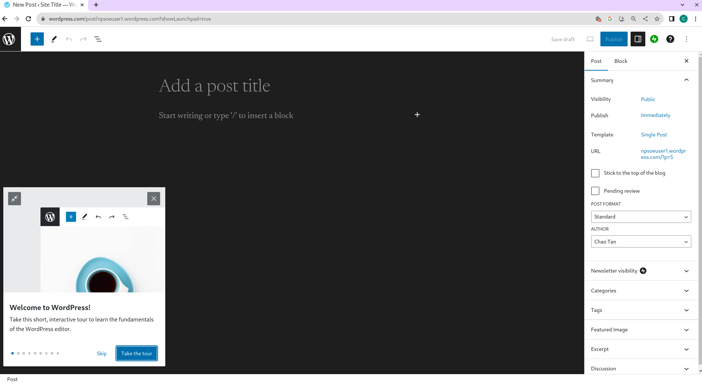

10. You are done! You can start building your site! There is also an interactive tour that shows you the basics. 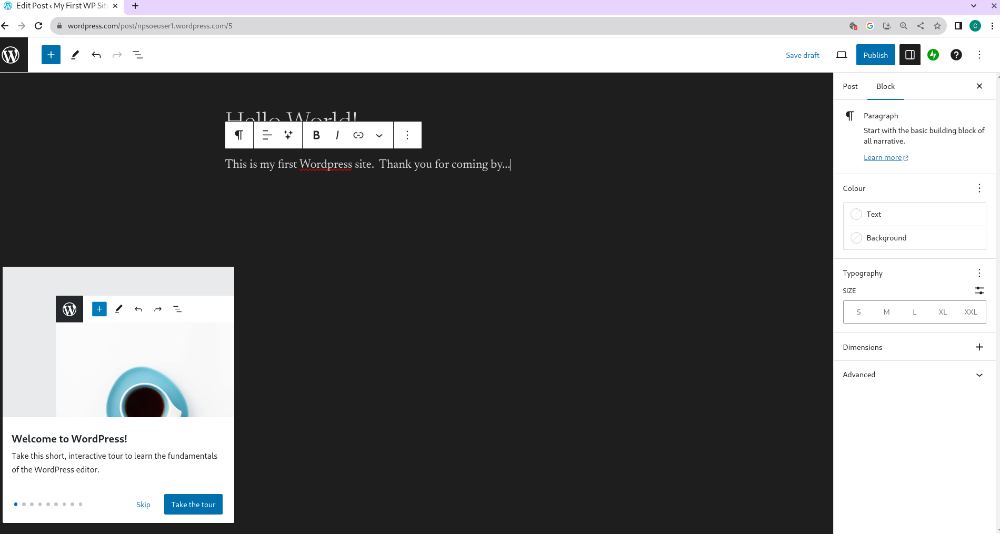

11. After you are done, click on the "Publish" button at the top right to publish your site. 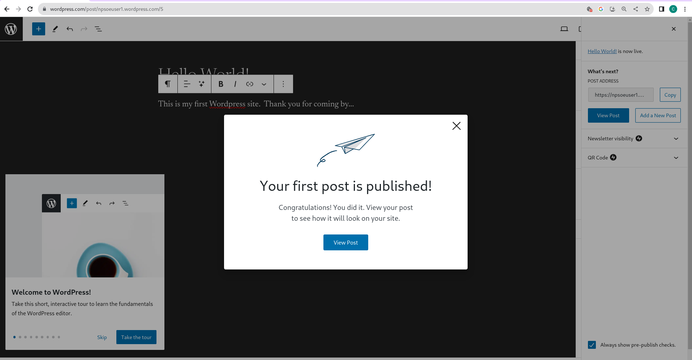

12. Congratulations, you have successfully published your first WordPress site! 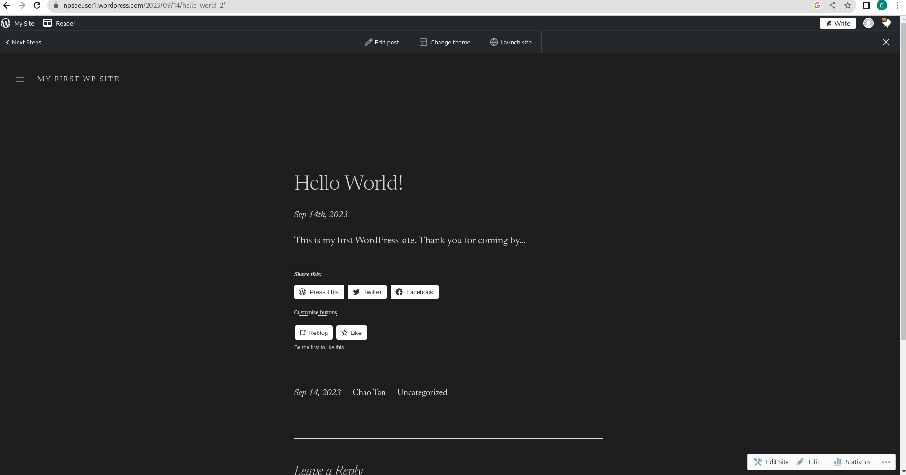

13. Feel free to play around with your site, such as updateing the themes and further customisations.  

# Conclusion
In this activity, you have build a hosted website on wordpress.com 

In the hosted model, all the servers and wordpress software has already been installed for you.  You do not have to manage the operating system or application software.  This model is **Software as a Service (SaaS)**.  